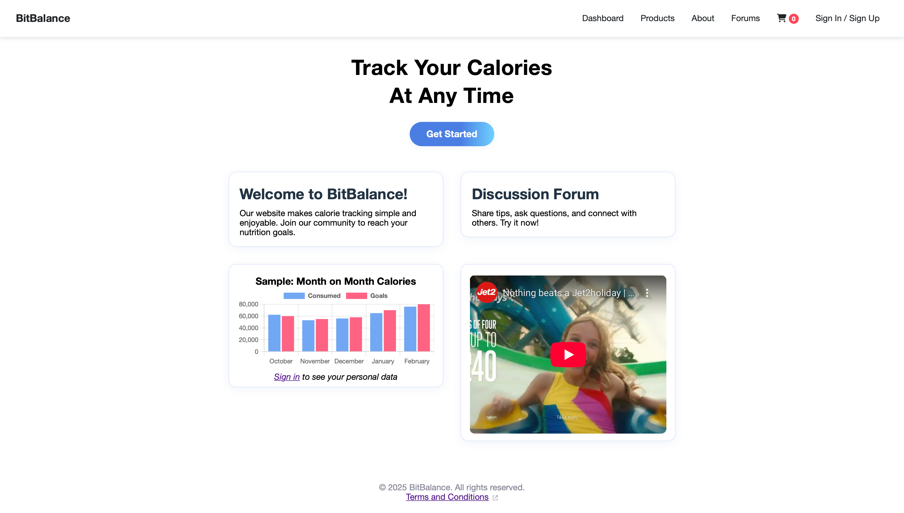
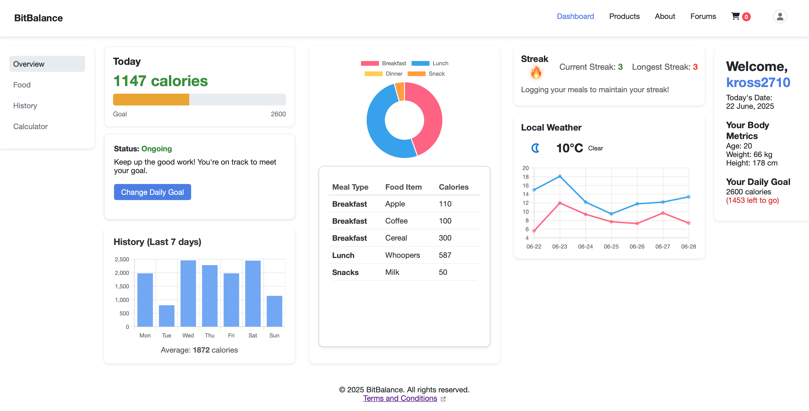
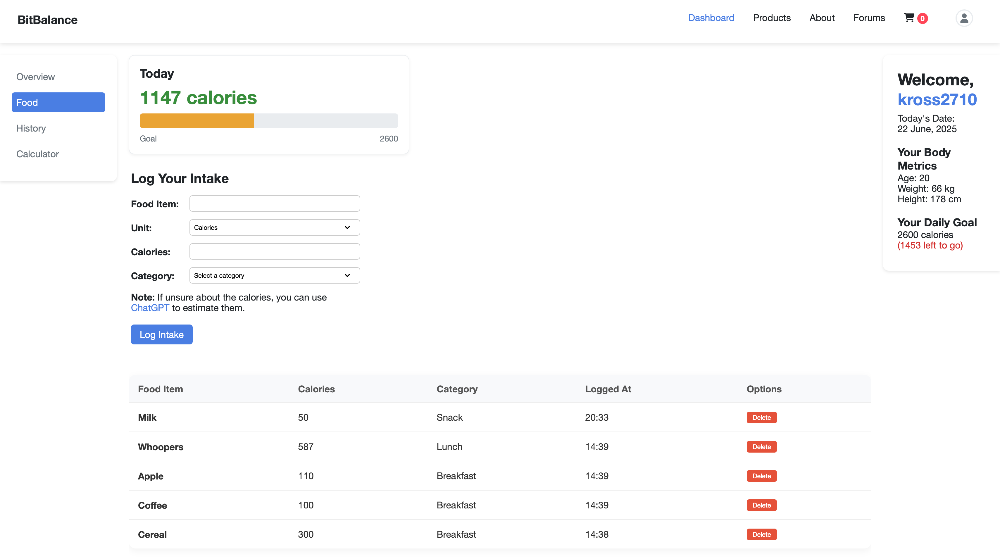
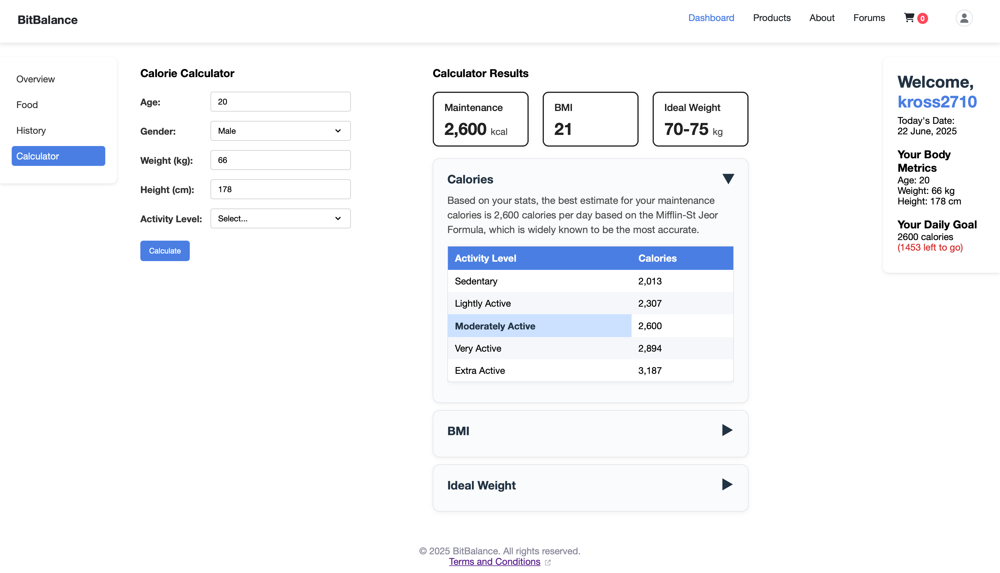

# BitBalance

BitBalance is a web-based nutrition and calorie management platform that helps users track their daily food intake, set calorie goals, and monitor their progress over time. The app also includes user authentication, an admin dashboard, a simple forum, and a product listing.

---

## Test Account
User:
- Email: user@example.com
- Password: 123456

Admin:
- Email: admin@gmail.com
- Password: admin123

Alternatively, you can create your own account, the sign-up and sign-in processes are fully functional, and your password is securely hashed.

---

## Features

- User registration and login (session-based authentication)
- Dashboard with calorie intake tracker and 7-day history chart
- Set and edit daily calorie goals
- Intake log: add, view, and delete food entries
- Product with shopping basket
- Forum: posts, comments, and likes
- Admin dashboard for managing users, posts, and products
- Responsive, mobile-friendly UI

---

## Tech Stack

- **Frontend:** HTML, CSS, JavaScript
- **Backend:** PHP (PDO for MySQL)
- **Database:** MySQL
- **Tools:** XAMPP (for local development)
- **Version control:** Git, GitHub

---

## Setup & Installation

1. **Clone this repo**
    ```bash
    git clone https://github.com/rmit-computing-technologies/prototype-milestone-2-group_20_wps_2025.git
    ```

2. **Import the Database**
    - Use `phpMyAdmin` or the MySQL CLI to import the provided SQL files from `/database` (if available).
    - Make sure your MySQL user and password are set in `db_config.php`.

3. **Configure Environment**
    - Edit `db_config.php` with your local database credentials.

4. **Run Locally**
    - Place the project in your local web server’s directory (e.g. `htdocs` for XAMPP).
    - Visit `http://localhost/prototype-milestone-2-group_20_wps_2025/` in your browser.
    - Visit `http://localhost/prototype-milestone-2-group_20_wps_2025/admin/admin.php` (for admin pages)

---

## Usage

- **Sign Up** for an account or log in (User). 
- **Admin Sign Up**, visit `http://localhost/prototype-milestone-2-group_20_wps_2025/admin/admin-signup.php` (For demo purposes only)
- **Set your daily calorie goal** via the Dashboard.
- **Add food intake** on the Intake page.
- **View your weekly progress** with dynamic charts.
- **Admins** can access admin tools via `/admin/admin.php`.

---

## Contributors

- Dam Khanh Hung Vu
- Andrew Jacovelli
- Tommy Ngo
- Turin Sayed

---

## License

This project is for educational purposes.  
MIT License.

---

## Screenshots


**BitBalance Homepage**


**BitBalance Dashboard**


**BitBalance Dashboard Intake**


**BitBalance Dashboard Calculator**

---

## Contact

For any issues or questions, open a GitHub issue or contact [s3974781@rmit.edu.vn].