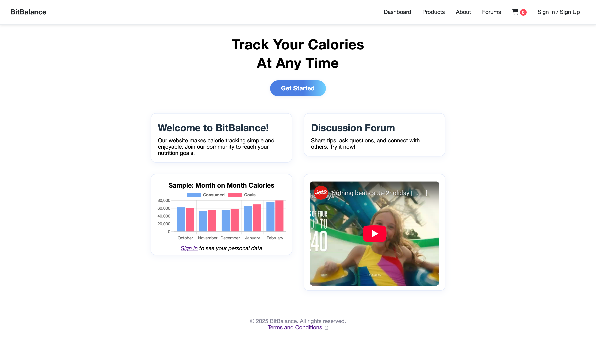
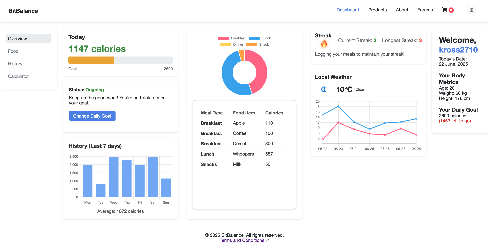
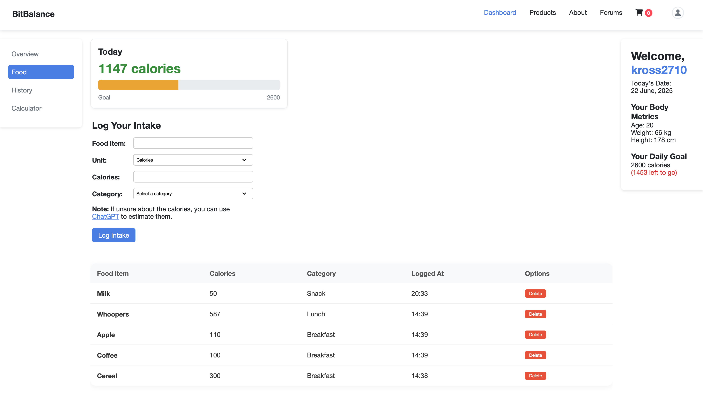
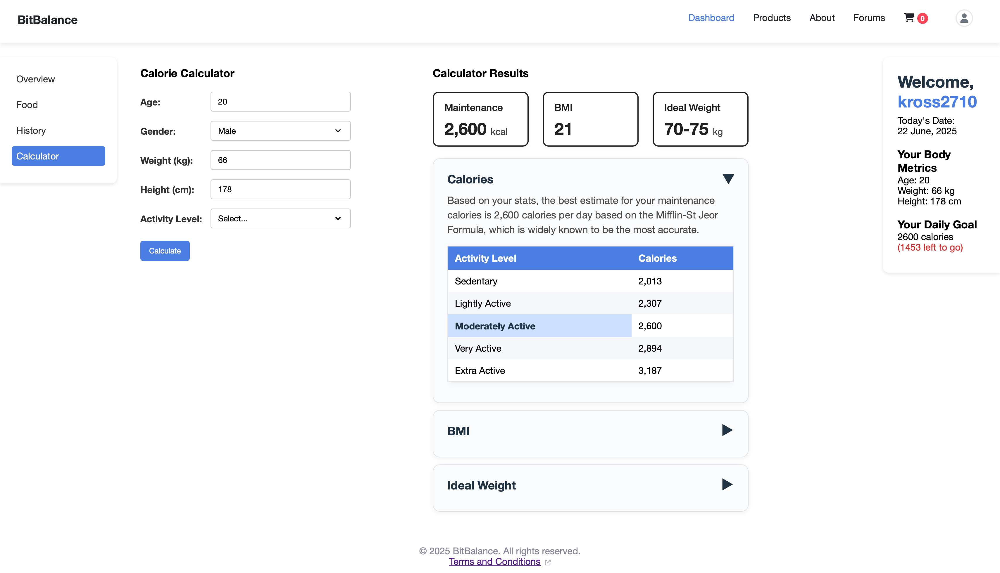

# BitBalance — AI-Assisted Calorie Tracking Platform

BitBalance is a modular full-stack web application designed to help users track daily calorie intake, manage nutrition goals, and monitor progress over time.

The system integrates AI-powered food image analysis via Gemini API and includes multi-role access control (User/Admin), forum interaction, and product management features.

> ⚠️ To enable AI functionality, create `include/secrets.php` and add your Gemini API key (see [Setup & Installation](#setup--installation)).

🌐 **Live demo:** [titan.csit.rmit.edu.au/~s3974781/bitbalance](https://titan.csit.rmit.edu.au/~s3974781/bitbalance/dashboard/dashboard.php)

---

## 🎯 Project Motivation

This system was developed to explore AI-assisted health tracking and demonstrate secure full-stack PHP development using modular architecture.

## 🧠 Technical Highlights

- Secure password hashing (`password_hash`, `password_verify`)
- Modular backend structure
- Gemini AI API integration with server-side processing
- Dynamic chart rendering using Chart.js
- Secure PDO prepared statements
- Light + dark theme via a token-driven CSS system

---

## 🚀 System Overview

BitBalance is structured into modular backend components to separate concerns and maintain scalability:

- **Authentication Module** — Session-based login with password hashing
- **Calorie Tracking Module** — Intake logging and daily goal management
- **AI Integration Module** — Image processing and calorie extraction
- **Admin Module** — User, system log and content management (work in progress)

Database communication is handled using PDO with prepared statements to prevent SQL injection.

## 🏗 Architecture

The system follows a modular MVC-inspired structure:

- **Controllers** handle request routing and business logic (`include/handlers/`, `dashboard/handlers/`).
- **Models** manage database interactions via PDO (defined inline with handlers; centralized config in `include/db_config.php`).
- **Views** are rendered using PHP templates in `views/` and `dashboard/views/`.

### Frontend / Theming

The CSS is organized as a layered design system to keep page styles consistent and dark-mode-friendly:

| Layer | Path | Purpose |
|---|---|---|
| Tokens | `css/tokens.css` | Single source of truth for design variables: `--color-*`, `--shadow-*`, `--radius-*`, `--font-*`, `--z-*`. Includes a full dark-theme override and backward-compatible aliases for legacy variable names. |
| Base | `css/base.css` | Reset, typography, body, utility classes. |
| Components | `css/components/*.css` | `header`, `footer`, `sidebar`, `forms`, `cookie-banner`. Token-driven so dark mode adapts automatically. |
| Pages | `css/dashboard.css`, `css/forum.css`, `css/products.css`, … | Page-specific styles loaded after components. |
| Loader | `views/head_css.php` | A single include each page uses to pull tokens + base + components in the correct order. |

A page only needs:

```php
<?php include PROJECT_ROOT . 'views/head_css.php'; ?>
<link rel="stylesheet" href="<?= BASE_URL ?>css/<page>.css">
```

Dark mode is toggled via `data-theme="dark"` on `<html>` (persisted in the user's profile).

---

## 🗄 Database Overview

BitBalance uses a relational MySQL database designed with data integrity, scalability, and modularity in mind.

The schema enforces structured relationships through foreign key constraints and follows a normalized design to reduce redundancy.

### 🔑 Core Entities

- **user** — Stores account credentials, role (regular/admin), and profile information
- **userStatus** — Tracks account state, login attempts, and activity streaks
- **userGoal** — Stores daily calorie goals
- **intakeLog** — Records food intake entries and calorie values
- **weight_log** — Tracks user weight progress over time

### 🔐 Security & Audit Tables

- **login_attempts** — Tracks login activity and IP addresses
- **password_resets** — Secure token-based password recovery
- **activity_log** — Logs user actions for auditing
- **site_fees** — Configurable system fees

### 📊 Design Considerations

- Foreign key constraints with cascading rules ensure referential integrity
- Unique constraints (e.g., user email) prevent duplication
- ENUM fields are used for controlled status values
- Indexed columns improve performance for frequent queries (login attempts, orders, forum interactions)

The database supports modular expansion and aligns with the application's multi-role architecture.

---

## 🔐 Security Considerations

- Password hashing for user authentication
- Session-based access control
- PDO prepared statements to prevent SQL injection
- Basic input validation and sanitization
- Server-side validation for all critical form inputs
- Role-based access verification on protected routes
- Prevention of direct URL access to admin-only pages

## ✨ Features

- User registration and login
- AI-assisted calorie estimation from food images
- Calorie intake logging with 7-day progress chart
- Set and update daily calorie goals
- CRUD operations for intake records
- Forum with posts, comments, and likes
- Product listing with basket functionality
- Admin dashboard for user and content management
- Light / dark theme toggle (user preference persisted)
- Responsive UI

---

## 🛠 Tech Stack

- **Frontend:** HTML, CSS (token-driven design system), JavaScript, Chart.js
- **Backend:** PHP (PDO for MySQL)
- **Database:** MySQL
- **Tools:** XAMPP (for local development)
- **Version control:** Git, GitHub

## ⚙️ Setup & Installation

1. **Clone the repository**

    ```bash
    git clone https://github.com/Kross2710/BitBalance-2.0---Calorie-Tracker.git
    ```

2. **Import the database**

    - Use `phpMyAdmin` or the MySQL CLI to import the SQL file from `include/database.sql`.
    - Make sure your MySQL user/password are set correctly (see step 3).

3. **Configure environment**

    - Edit `include/db_config.php` with your local database credentials.
    - For Gemini AI in the dashboard intake page, create `include/secrets.php` with your own API key:

    ```php
    <?php
    // Gemini API key. Keep this file out of version control.
    // In production use a proper secret manager / .env file.
    define('GEMINI_API_KEY', 'YOUR_API_KEY_HERE');
    ```

    > `include/secrets.php` is already in `.gitignore`, so your key won't be committed.

4. **Run locally**

    - Place the project in your local web server's directory (e.g., `htdocs/` for XAMPP).
    - Visit `http://localhost/BitBalance-2.0---Calorie-Tracker/` in your browser.
    - Admin entry point: `http://localhost/BitBalance-2.0---Calorie-Tracker/admin/admin.php`.

---

## 🧪 Test Account

You can create your own account — the sign-up and sign-in flows are fully functional and your password is securely hashed.

**Demo admin:**

| Email | Password |
|---|---|
| `admin@gmail.com` | `admin123` |

## 📖 Usage

- **Sign up / log in** as a regular user.
- **Admin sign up** (demo only): `http://localhost/BitBalance-2.0---Calorie-Tracker/admin/admin-signup.php`.
- **Set your daily calorie goal** via the dashboard.
- **Add food intake** on the Intake page (with optional AI image analysis).
- **View weekly progress** with dynamic charts.
- **Admin tools** at `/admin/admin.php`.

## 📸 Screenshots

| | |
|---|---|
|  **Homepage** |  **Dashboard** |
|  **Dashboard — Intake** |  **Dashboard — Calculator** |

## 📄 License

This project is for educational purposes.
Licensed under the MIT License.

## 📬 Contact

For any issues or questions, open a GitHub issue or contact [s3974781@rmit.edu.vn](mailto:s3974781@rmit.edu.vn).
